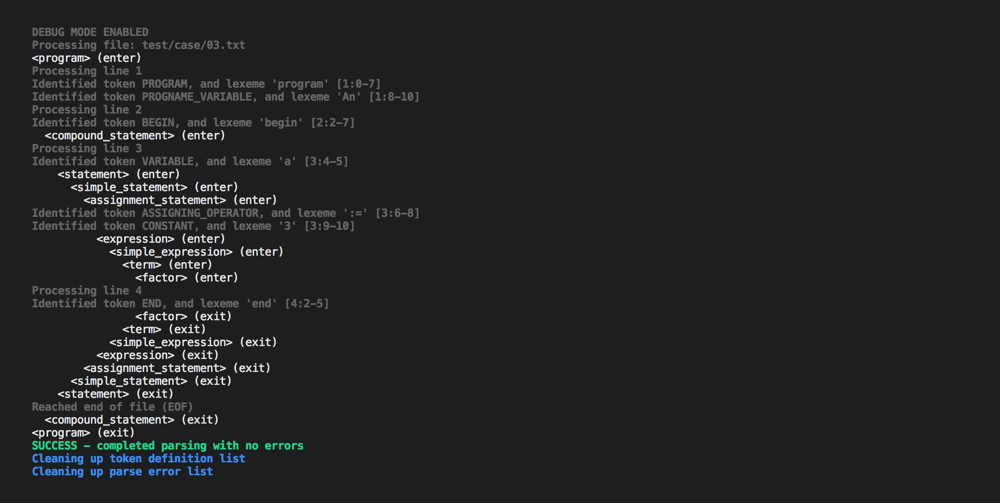
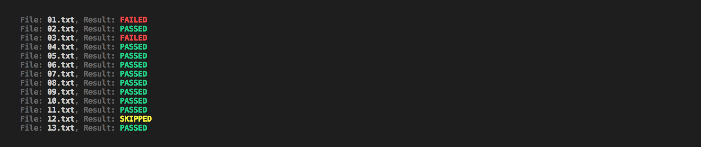
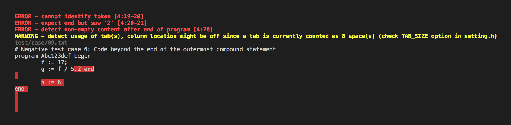

# Mer-C-less
A rudimentary parser concealing within itself a regex-based lexcial analyzer and a LL(1) top-down passer.

## The Good, the Bad, and the Ugly
The grammar rules in EBNF are defined below. Note that [] and {} are not _terminals_. Besides, if any non-space characters are detected after a program end, an error is reported.

	<program> ::= program <progname> <compound stmt>
	<compound stmt> ::= begin <stmt> {; <stmt>} end
	<stmt> ::= <simple stmt> | <structured stmt>
	<simple stmt> ::= <assignment stmt> | <read stmt> | <write stmt> |
			  <comment>
	<assignment stmt> ::= <variable> := <expression>
	<read stmt> ::= read ( <variable> { , <variable> } )
	<write stmt> ::= write ( <expression> { , <expression> } )
 	<comment> ::= # alltext to end of line ignored
 	<structured stmt> ::= <compound stmt> | <if stmt> | <while stmt>
 	<if stmt> ::= if <expression> then <stmt> |
 		      if <expression> then <stmt> else <stmt>
 	<while stmt> ::= while <expression> do <stmt>
 	<expression> ::= <simple expr> |
 			 <simple expr> <relational_operator> <simple expr>
	<simple expr> ::= [ <sign> ] <term> { <adding_operator> <term> }
	<term> ::= <factor> { <multiplying_operator> <factor> }
	<factor> ::= <variable> | <constant> | ( <expression> )
	<sign> ::= + | -
	<adding_operator> ::= + | -
	<multiplying_operator> ::= | /
	<relational_operator> ::= = | <> | < | <= | >= | >
	<variable> ::= <letter> { <letter> | <digit> }
	<constant> ::= <digit> { <digit> }
	<progname> ::= <capital_letter> { <letter> | <digit> }
	<capital_letter> ::= A | B | C | ... | Z
	<letter> ::= a | b | c | ... | z | <capital_letter>
	<digit> ::= 0 | 1 | 2 | 3 | 4 | 5 | 6 | 7 | 8 | 9

Mer-C-less parser, at syntax analyzing step, will check if the current token matches what is expected, if a match occurs, the next token is requested from the lexcial analyzer, otherwise, it adds a syntax error and keep the current token for the next match, assuming that the current expected token has been satisfied. This behavior is crucial to the parser and must be noted.

## Usage
A `Makefile` is prepared for, of course, making. Several targets are available at your service. Simply `cd` to the source directory and use one of the followings:

```
make
make clean
make re
make debug
make test
make test-debug
```

The first is simply used to compile the source codes. The second is to cleanup all prior compilation. The third runs a `make clean` before running `make`. The third runs `make` with _DEBUG_ flag enabled. In debug mode, detailed messages from lexical analyzer, syntax analyzer and parser are shown. 



The target `make test` compiles the source code, runs prepared test cases in `test/case` and match the output with the expected_output in `test/expected_output`. Note that the filename must match for test to be run, otherwise, it is __SKIPPED__. Target `make test-debug` runs each test in debug mode without outcome matching.



As for the token definition list, they are stored in the text file called _token_definition.txt_ together with the POSIC regex pattern which can be used to match them. Note that the order of definition really matters and as you update the token list, remember to update the header of this file as well. The header, i.e. the first 3 lines indicate the number of entries, the maximum length allowed for token name and the maximum length allowed for pattern, respectively. _tl; dr - Edit this file with caution_

If one wishes to only parse a single file, use the following command

```
./parse <file_to_be_parsed>
```

## Options
Refer to the setting.h file to see all available options. Most options are rather comprehensible, such as:
```
PARSE_DEBUG_ENABLED
LEX_DEBUG_ENABLED
TAB_SIZE_WARNING_ENABLED
TAB_SIZE
...	
```
You might want to check the `TAB_SIZE` option for more accurate error location information. Mer-C-less hides within itself a hidden gem where it allows error mapping on source, this can be enabled by setting `CODE_DISPLAY_ENABLED` to `1`. This should allow the program to show error-mapped source in _normal_ and _debug_ mode.



Last but not least, you can customize the color of output, they are all in ANSI format. A list of commonly used colors is also included at the bottom of the setting file.